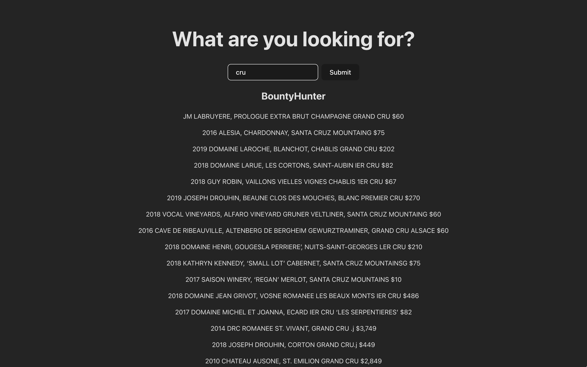

# Table of contents

- [Example](#example-search-result)
- [Setup](#setup-steps)
- [Developer Notes](#developer-notes)

## Example search result



## Setup steps

### 1. Create the database

Uncomment the following line

```python
# iterateOverParsedFiles(createConnection())
```

located at the end of `db_functions.py`. After that, execute the file.

### 2. Start the frontend and API with Docker

Make sure you're in the root directory.
Execute `docker compose up`

The app should now be accessible at http://localhost:3030
and the API at http://localhost:5001

## Developer Notes

Some things to keep in mind for those looking to contribute.

### Mandatory

- Parsed files must have a dollar sign to delimit the wine name and price. This is essential to be able to extract this information and sucessfully insert it into the database.

### Formatting

Parsed files should also have:

- no leading/trailing whitespace
- no empty lines
- no quotation marks (single or double)
